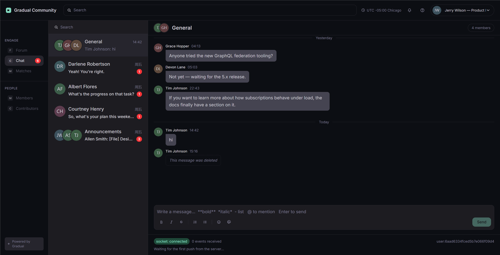
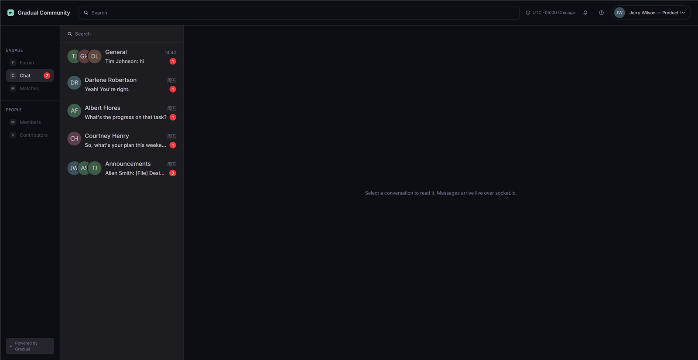
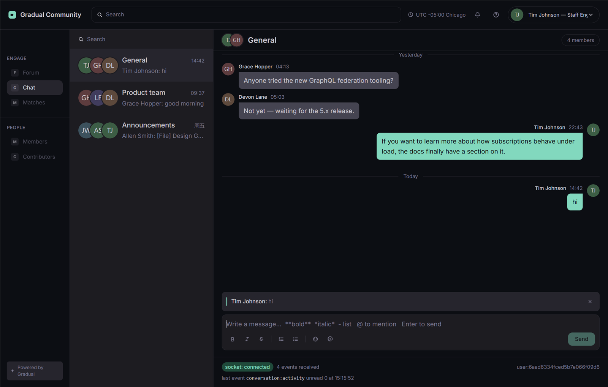
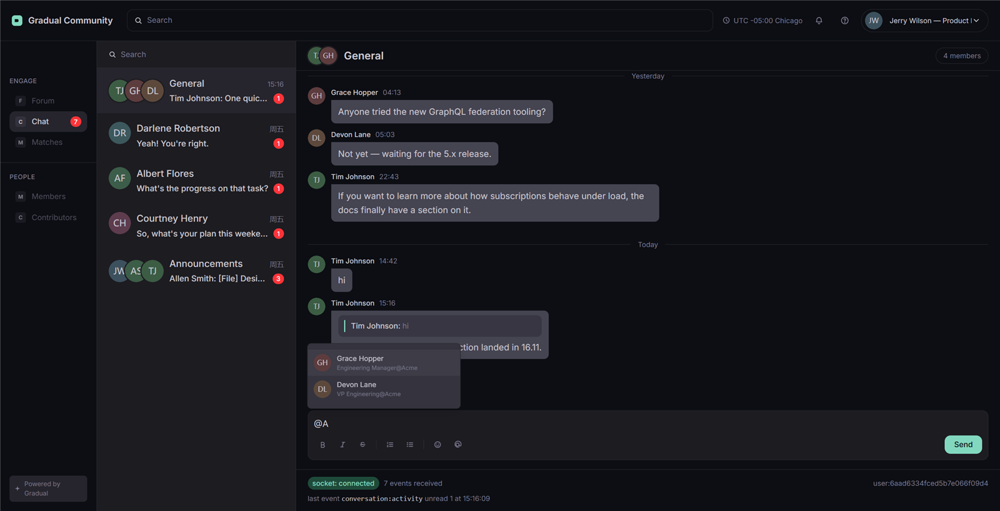

# Demo — what to look at, in what order

Every screenshot below is a running instance with `pnpm seed` data. Nothing is mocked and nothing is
re-staged; the two-tab sequence is the feature, not a rendering of it.

---

## 1. The screen



Three columns, dark palette, Inter — the shell, the row rules (a non-DM preview carries a `Sender: `
prefix, a DM does not) and the unread badges all come from the design file.

The strip along the bottom of the conversation panel is the **realtime panel**. It reports the socket
state, the event count since the page loaded, the last event's name and time, and the id it is
connected as. It exists so that "was that socket.io or a refetch?" is answerable by looking rather
than by opening devtools — see step 4.

## 2. Identity is per tab



There is no password flow. The picker writes a user id to `sessionStorage`, so **each tab is a
different user**. This is deliberate: `localStorage` is shared per origin, two tabs could never be
two users, and the receiving half of the demo would be impossible on one machine.

## 3. Composing: a quote and a mention



Both composer states in one frame. The card at the top is a **quote under construction** — the
accent bar, the author and the excerpt, with an X to dismiss it. Above the caret is the **mention
dropdown**, filtered to the members of the conversation as you type.

## 4. The realtime path, in one frame



A second tab (a different user) sent a message. In this frame, three things moved without a page
load:

- the **message stream** — the new message, at the correct end of the stream;
- the **list row** — preview and timestamp, because `conversation:activity` carries the message
  itself, not a server-flattened string;
- the **unread badge** — computed server-side per recipient at emit time.

The realtime panel reads **7 events received** and names the last one. The count is the evidence: a
refetch-based client would show a stream that updates and a panel that stays at zero.

---

## The 90-second walkthrough

Two windows side by side, `http://localhost:4173` in both, then:

| Time | Do this                                                                          | Say this                                                                                                                                                                  |
| ---- | -------------------------------------------------------------------------------- | ------------------------------------------------------------------------------------------------------------------------------------------------------------------------- |
| 0:00 | Both windows on the same channel, different identities in the picker             | "Two tabs, two users — identity lives in `sessionStorage`, so this works on one machine."                                                                                 |
| 0:10 | Type a message in window A, hit Enter                                            | "The write is a GraphQL mutation. socket.io only pushes — it never writes, so authorisation and validation live in exactly one place."                                    |
| 0:20 | Point at window B                                                                | "It landed there with no refetch. The client writes the Apollo cache directly; the event count in that panel is the proof."                                               |
| 0:30 | Send a second message while B is looking at a **different** channel              | "The list row and the badge moved anyway — that event goes to the user's own room, not the conversation room."                                                            |
| 0:40 | Hover a message in B, click quote, type, then send                               | "The quote is a frozen snapshot, not a foreign key. Delete the original and the card still reads — no join on the read path."                                             |
| 0:55 | Type `@` in the composer                                                         | "Mentions are inline markdown links carrying a user id, so renaming someone does not break them. The candidate list is the conversation's members, nothing stored twice." |
| 1:05 | Open `http://localhost:4000/graphql` and run `{ conversations { unreadCount } }` | "Unread is derived server-side from the read cursor. A stored counter would have to be adjusted on send, read and delete — and any missed path drifts forever."           |
| 1:20 | `pnpm test` in a terminal                                                        | "224 tests: pure logic with no database, integration against a real MongoDB, and the socket contract against a real server and a real client."                            |

If a step misbehaves live, the fallback is to open `docs/DECISIONS.md` and talk through the decision
instead — every claim above is written down there with what was rejected.

## Running it

```bash
pnpm install
cp apps/api/.env.example apps/api/.env
cp apps/web/.env.example apps/web/.env
pnpm seed     # prints the user ids the picker shows
pnpm dev      # API on :4000, web on :4173
```

Two tabs on <http://localhost:4173>, a different identity in each, then send a message from one to
the other. `pnpm test` needs MongoDB for the integration layer; without it those files skip
themselves and print why, so the rest of the suite still runs.
